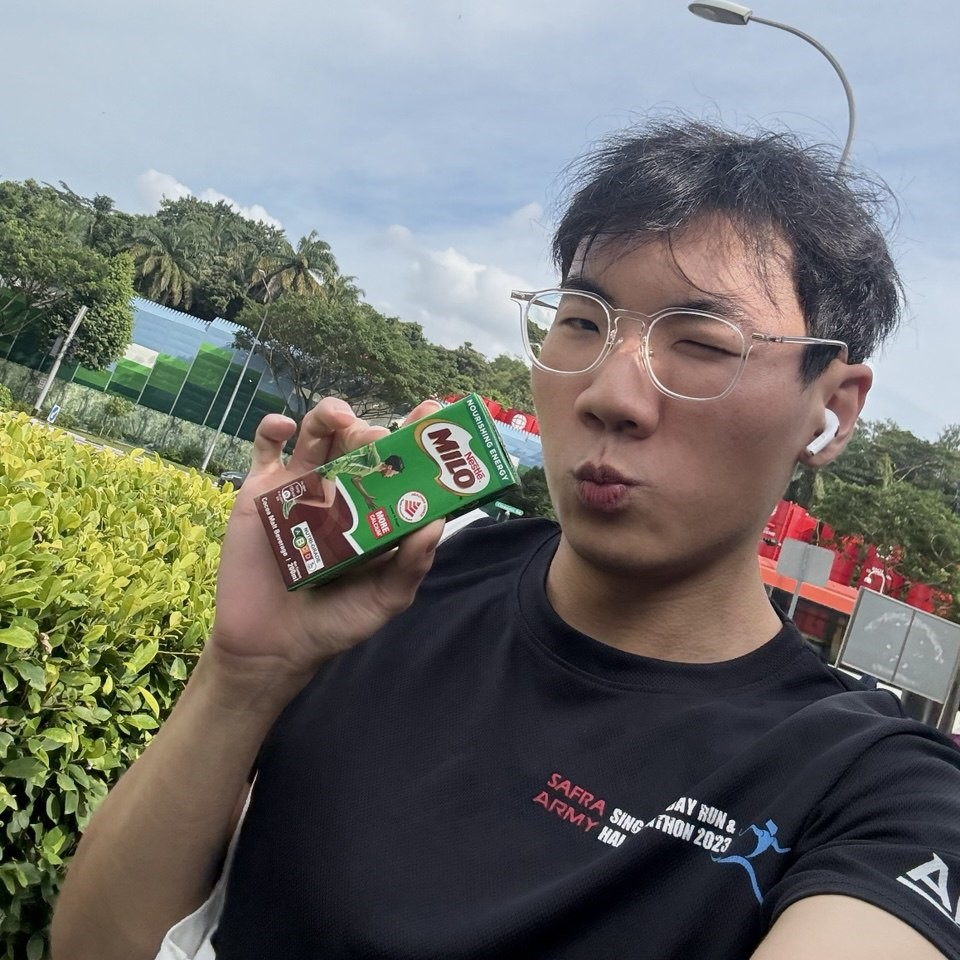
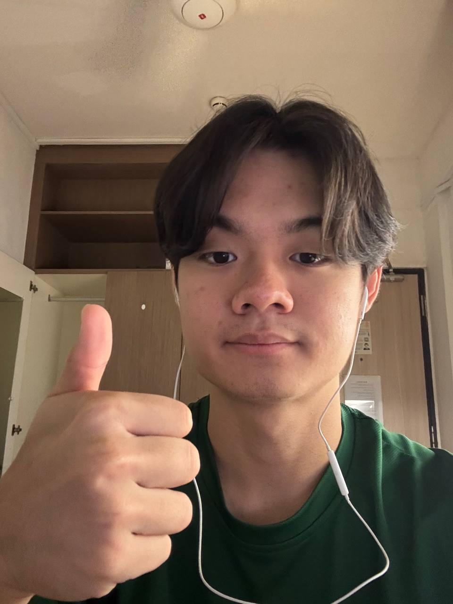
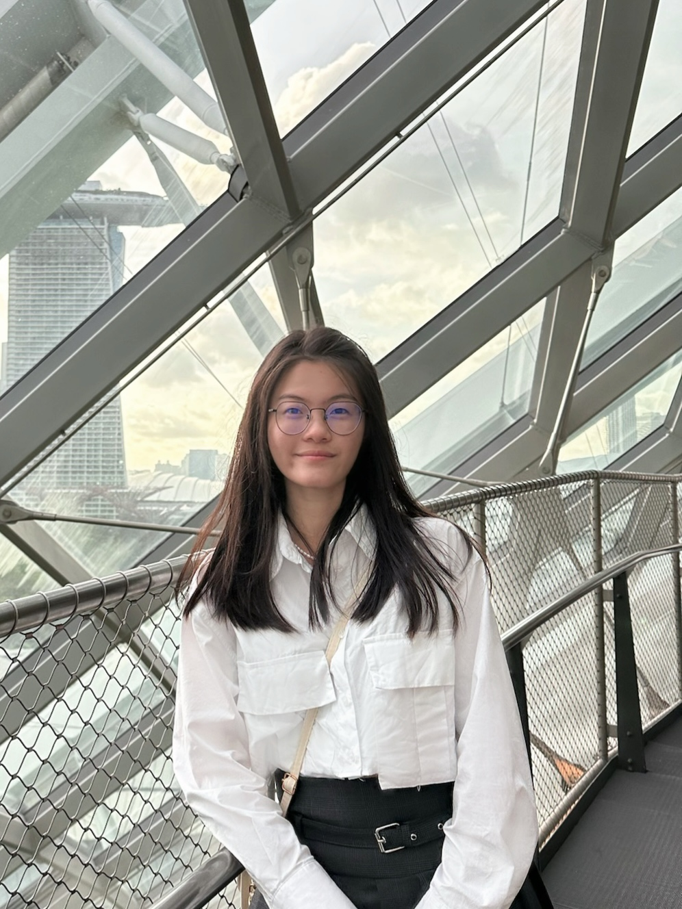

# About Us

We are a team based in the [School of Computing, National University of Singapore](http://www.comp.nus.edu.sg).

You can reach us at the email `ryanc[at]comp.nus.edu.sg`

## Project team

### Ryan

  

[[LinkedIn](https://www.linkedin.com/in/ryanno3o/)]
[[github](https://github.com/bipplane)]
[[portfolio](team/bipplane.md)]

* Role: Team lead, Developer
* Responsibilities: Scheduling & Tracking

### Yin Zi

  

[[github](http://github.com/izniy)]
[[portfolio](team/izniy.md)]

* Role: Developer
* Responsibilities: Code Quality, Documentation

### Nicolas

  

[[github](http://github.com/nicolaskjh)] 
[[portfolio](team/nicolaskjh.md)]

* Role: Developer
* Responsibilities: Testing, Integration

### Joselyn

  

[[github](http://github.com/flljy940)]
[[portfolio](team/flljy940.md)]

* Role: Developer
* Responsibilities: Deliverables and deadlines, Expert
