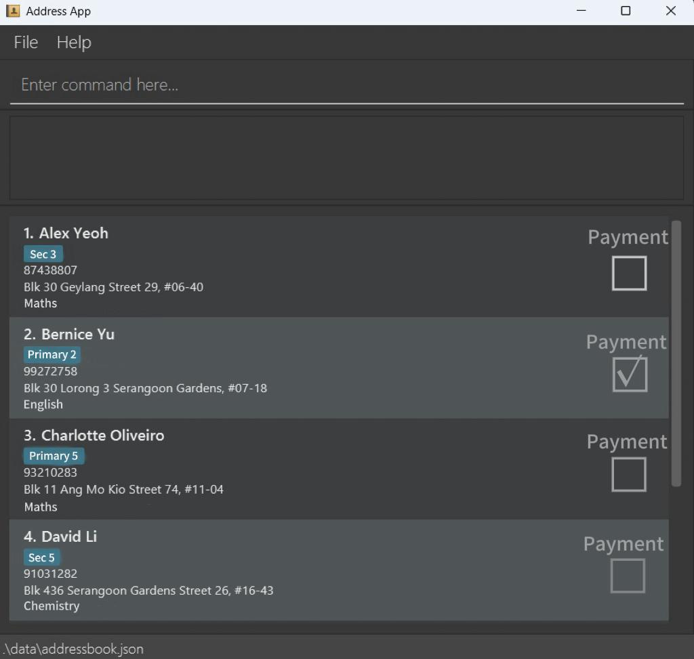
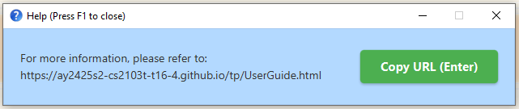
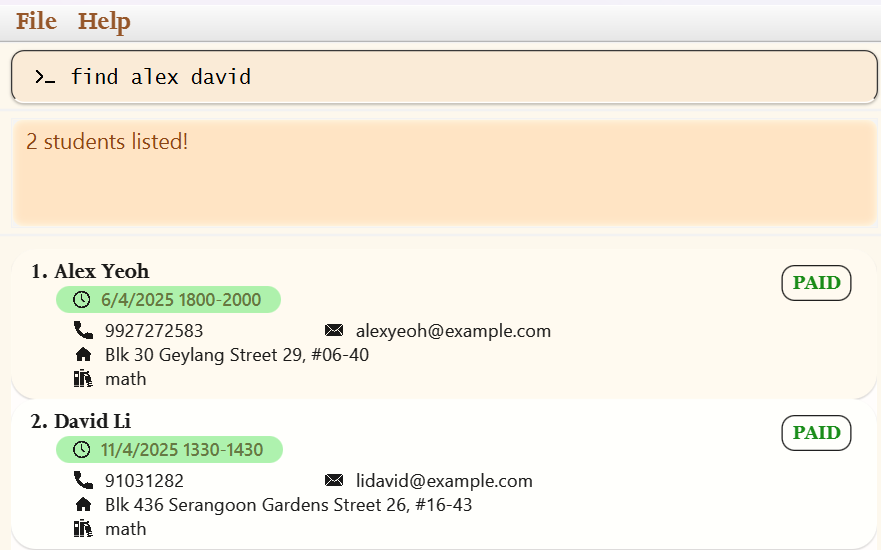
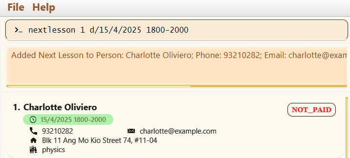
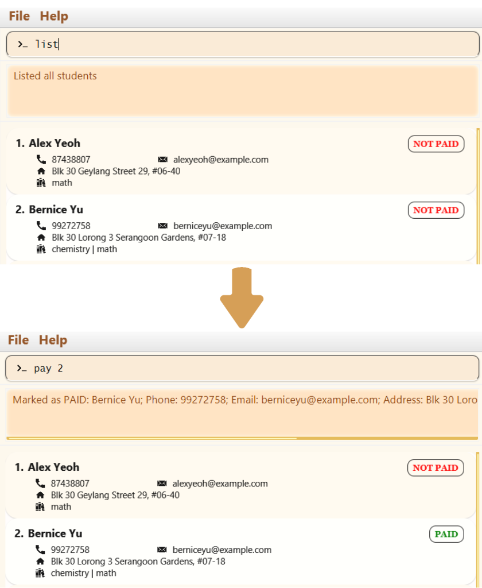

# TutorRec User Guide

TutorRec is a **desktop application designed to help tutors effectively manage their student records**.
While it features a clean and intuitive Graphical User Interface (GUI), TutorRec is **optimised for fast keyboard-based interaction via a Command Line Interface (CLI)**.
This makes it ideal for tutors who prefer speed and precision when handling tasks like tracking student contacts, subjects, payment statuses, next lessons and more.

Whether you're managing a few students or a large tutoring roster, TutorRec eliminates the administrative headaches that steal time from what matters most - your teaching!

This guide assumes you're comfortable using a computer, and doesn't require any prior programming knowledge.

Encountered some terms you don't understand? Check out our [Glossary](#glossary) at the end of this document for definitions.

<!-- * Table of Contents -->
<page-nav-print />

--------------------------------------------------------------------------------------------------------------------

## Quick start

1. **Set up Java**
   * Ensure you have Java `17` or above installed on your computer.
   * Unsure how to check or install Java? Follow these guides based on your system:
     * [**Windows Setup Guide**](https://se-education.org/guides/tutorials/javaInstallationWindows.html)
     * [**Mac Setup Guide**](https://se-education.org/guides/tutorials/javaInstallationMac.html)
     * [**Linux Setup Guide**](https://se-education.org/guides/tutorials/javaInstallationLinux.html)

2. **Download TutorRec**
   * Get the latest version [here](https://github.com/AY2425S2-CS2103T-T16-4/tp/releases).
   * Look for the file named `tutorrec.jar` under the latest release.
   * Click on it to download.

3. **Install the application**
   * Create a new empty folder, where you want to keep the TutorRec application.
   * Copy the downloaded `.jar` file into this folder.

4. **Start TutorRec**
   * **Windows users**: Simply double-click the `.jar` file.
   * **If double-clicking doesn't work**: Open Command Prompt, navigate to your folder with `cd path\to\your\folder`, then type `java -jar tutorrec.jar` and press Enter.
   * **Mac/Linux users**: Open Terminal, navigate to your folder with `cd path/to/your/folder`, then type `java -jar tutorrec.jar` and press Enter.
   * Not sure how to open your Command Prompt/Terminal? Follow these simple guides based on your system:
     * [**Windows Tutorial**](https://learn.microsoft.com/en-us/windows/terminal/faq)
     * [**Mac Tutorial**](https://support.apple.com/en-sg/guide/terminal/apd5265185d-f365-44cb-8b09-71a064a42125/mac)
     * [**Linux Tutorial**](https://ubuntu.com/tutorials/command-line-for-beginners#1-overview)
   * You should see the TutorRec application window appear with some sample data:

     

5. **Familiarise yourself with the interface**
   * Here are some basic commands to get you started, which you can type in the command box as shown below:

     

   * `list` → Shows all your students
   * `add n/John Doe p/98765432 e/johnd@example.com a/John street, block 123, #01-01` → Adds a new student
   * `pay 1` → Marks the first student as PAID
   * `nextlesson 1 d/15/4/2025 0900-1030` → Sets the next lesson for first student
   * `exit` → Closes the application (your data is automatically saved)

6. **Need help?** Type `help` in the application itself, or press F1 to view the complete user guide.

<box type="tip" seamless>

**Tip:** TutorRec will tell you if your command fails to be executed properly in the blank area right below the command box.
</box>

--------------------------------------------------------------------------------------------------------------------

## Command summary

| Action                   | Format, Examples                                                                                                                                                     |
|--------------------------|----------------------------------------------------------------------------------------------------------------------------------------------------------------------|
| **Add**                  | `add n/NAME p/PHONE_NUMBER e/EMAIL a/ADDRESS [s/SUBJECT]…​`   e.g. `add n/James Ho p/22224444 e/jamesho@example.com a/123, Clementi Rd, 1234665 s/math s/english` |
| **Clear**                | `clear`                                                                                                                                                              |
| **Pay**                  | `pay INDEX`  e.g. `pay 3`                                                                                                                                         |
| **Unpay**                | `unpay INDEX`  e.g. `unpay 3` or `unpay all`                                                                                                                      |
| **Delete**               | `delete INDEX`  e.g. `delete 3`                                                                                                                                   |
| **Edit**                 | `edit INDEX [n/NAME] [p/PHONE_NUMBER] [e/EMAIL] [a/ADDRESS] [s/SUBJECT]…​`  e.g.`edit 2 n/James Lee e/jameslee@example.com`                                       |
| **Find**                 | `find KEYWORD [MORE_KEYWORDS]…​`  e.g. `find James Jake`                                                                                                          |
| **NextLesson**           | `nextlesson INDEX d/[DATE]`  e.g. `nextlesson 3 d/15/4/2025 1800-2000`                                                                                            |
| **List**                 | `list`                                                                                                                                                               |
| **Sort**                 | `sort`                                                                                                                                                               |
| **Filter NextLesson**    | `filter-date DATE`  e.g. `filter-date 15/4/2025`                                                                                                                  |
| **Filter PaymentStatus** | `filter-payment STATUS`  e.g. `filter-payment PAID`                                                                                                               |
| **Filter Subject**       | `filter-subject SUBJECT [MORE_SUBJECTS]`  e.g. `filter-subject MATH`                                                                                              |
| **Help**                 | `help`                                                                                                                                                               |
| **Exit**                 | `exit`                                                                                                                                                               |

## Features

<box type="info" seamless>

**Notes about the command format:** 

* Words in `UPPER_CASE` are the parameters to be supplied by the user. 
  e.g. in `add n/NAME`, `NAME` is a parameter which can be used as `add n/John Doe`.

* Items in **square** brackets are **optional**. 
  e.g. `n/NAME [s/SUBJECT]` can be used as `n/John Doe s/math` or as `n/John Doe`.

* Items with `…`​ after them can be used multiple times including zero times. 
  e.g. `[s/SUBJECT]…​` can be used as ` ` (i.e. 0 times), `s/math`, `s/math s/chemistry` etc.

* Parameters can be in any order. 
  e.g. if the command specifies `n/NAME p/PHONE_NUMBER`, `p/PHONE_NUMBER n/NAME` will be interpreted as the same command.

* Date format for next lesson must be in `d/M/yyyy HHmm-HHmm` with the time in 24-hour format. 
  e.g. `nextlesson 3 d/15/4/2025 1800-2000`

* Extraneous parameters for commands that do not take in parameters (such as `help`, `list`, `exit` and `clear`) will be ignored. 
  e.g. if the command specifies `help 123`, it will be interpreted as `help`.

* If you are using a PDF version of this document, be careful when copying and pasting commands that span multiple lines as space characters surrounding line-breaks may be omitted when copied over to the application.
</box>

### Viewing help : `help`

Shows a message explaining how to access the help page.

 

Format: `help`

<box type="tip" seamless>

**Tip:** F1 can be used to open/close the help window.
</box>

### Adding a student: `add`

Adds a student to the contact list.

Format: `add n/NAME p/PHONE_NUMBER e/EMAIL a/ADDRESS [s/SUBJECT]…​`

<box type="tip" seamless>

**Tip:** A student can have any number of subjects (including 0).
</box>

<box type="info" seamless>

**Input constraints:** 

* `NAME` must contain letters, can include numbers, and should not exceed 50 characters.
* `PHONE_NUMBER` must only contain numbers and be between 3 and 15 digits long.
* `EMAIL` should be of the format `local@domain`, be at most 50 characters long, and adhere to the following constraints:
  * `local` should only contain alphanumeric characters or the characters `+`, `.`, `_` and `-`, not start or end with any special character and not contain any whitespaces.
  * `domain` is made up of `domain labels` separated by `.`.
    * `Domain labels` should only consist of alphanumeric characters separated only by `-` (if any) and start and end with alphanumeric characters.
    * The last `domain label` must be at least 2 characters long.
* `ADDRESS` must not exceed 100 characters.
* `SUBJECT`must contain only letters and numbers.

</box>

Examples:
* `add n/John Doe p/98765432 e/johnd@example.com a/John street, block 123, #01-01` adds a new student named John Doe with their contact details, but without any subjects.
* `add n/Betsy Crowe s/math e/betsycrowe@example.com a/Newgate p/1234567 s/physics` adds a new student named Betsy Crowe with their contact details, along with math and physics subjects.

### Listing all students : `list`

Shows a list of all students in the contact list.

Format: `list`

### Editing a student : `edit`

Edits an existing student in the contact list.

Format: `edit INDEX [n/NAME] [p/PHONE] [e/EMAIL] [a/ADDRESS] [s/SUBJECT]…​`

<box type="info" seamless>

**Input constraints:** 

* `INDEX` must be a positive integer 1, 2, 3…​ shown in the displayed student list.
* `NAME` must contain letters, can include numbers, and should not exceed 50 characters.
* `PHONE_NUMBER` must only contain numbers and be between 3 and 15 digits long.
* `EMAIL` should be of the format `local@domain`, be at most 50 characters long, and adhere to the following constraints:
    * `local` should only contain alphanumeric characters or the characters `+`, `.`, `_` and `-`, not start or end with any special character and not contain any whitespaces.
    * `domain` is made up of `domain labels` separated by `.`.
        * `Domain labels` should only consist of alphanumeric characters separated only by `-` (if any) and start and end with alphanumeric characters.
        * The last `domain label` must be at least 2 characters long.
* `ADDRESS` must not exceed 100 characters.
* `SUBJECT`must contain only letters and numbers.

</box>

* Edits the student at the specified `INDEX`.
* At least one of the optional fields must be provided.
* Existing values will be replaced with the new values.
* When editing subjects, the existing subjects of the student will be removed i.e. adding of subjects is not cumulative.
* You can remove all the student's subjects by typing `s/` without specifying any subjects after it.

Examples:
*  `edit 1 p/91234567 e/johndoe@example.com` Edits the phone number and email address of the 1st student to be `91234567` and `johndoe@example.com` respectively.
*  `edit 2 n/Betsy Crower s/` Edits the name of the 2nd student to be `Betsy Crower` and clears all existing subjects.

### Locating students by name: `find`

Finds students whose names contain any of the given keywords.

Format: `find KEYWORD [MORE_KEYWORDS]…​`

* The search is case-insensitive. e.g. `hans` will match `Hans`
* The order of the keywords does not matter. e.g. `Hans Bo` will match `Bo Hans`
* Only the name of the student is searched.
* Only full words will be matched e.g. `Han` will not match `Hans`
* Students matching at least one keyword will be returned (i.e. `OR` search).
  e.g. `Hans Bo` will return `Hans Gruber`, `Bo Yang`

Examples:
* `find John` finds all students with 'John' in their name (e.g. `john` and `John Doe`)
* `find alex david` finds all students with either 'Alex' or 'David' in their name (e.g. `Alex Yeoh`, `David Li`) 

 

### Deleting a student : `delete`

Deletes the specified student from the contact list.

Format: `delete INDEX`

<box type="info" seamless>

**Input constraints:** 

* `INDEX` must be a positive integer 1, 2, 3…​ shown in the displayed student list.

</box>

* Deletes the student at the specified `INDEX`.

Examples:
* `list` followed by `delete 2` deletes the 2nd student in the contact list.
* `find Betsy` followed by `delete 1` deletes the 1st student in the results of the `find` command.

### Adding next lesson date for a student : `nextlesson`

Adds a date for an upcoming lesson for an existing student in the contact list.

Format: `nextlesson INDEX d/DATE`

<box type="info" seamless>

**Input constraints:** 

* `INDEX` must be a positive integer 1, 2, 3…​ shown in the displayed student list.
* `DATE` must be in `d/M/yyyy HHmm-HHmm` format (e.g. `15/4/2025 1800-2000`).

</box>

* Adds the next lesson date for the student at the specified `INDEX`.
* Existing lesson dates will be updated to the input lesson dates.
* You can remove a student's next lesson by typing `d/` without any date after it.

Examples:
*  `nextlesson 2 d/` Removes the next lesson date for the 2nd student.
*  `nextlesson 1 d/15/4/2025 1800-2000` Adds/Updates the next lesson date of the 1st student to be `15/4/2025 1800-2000`.

 

<box type="warning" seamless>

**Caution:**
As TutorRec allows group tuition, it will not automatically check for lesson time clashes. Please ensure that you do not schedule overlapping lessons! Consider using the `sort` command after adding lessons to see your schedule in chronological order, which can help identify potential conflicts.
</box>

### Sorting of all students by lesson date : `sort`

Sorts the list of students by their next lesson date and time, with the earliest lesson shown first.

Format: `sort`

* Those without lesson dates will be shifted to the end of the list, after all contacts with valid lesson dates.

### Marking that a student made payment : `pay`

Marks the specified student as PAID to indicate that payment has been made.

Format: `pay INDEX`

<box type="info" seamless>

**Input constraints:** 

* `INDEX` must be a positive integer 1, 2, 3…​ shown in the displayed student list.

</box>

* Marks the student at the specific `INDEX` as PAID to indicate that payment has been made by the student.

Examples:
* `find David` followed by `pay 1` marks the 1st student in the results of the `find` command.
* `list` followed by `pay 2` marks the 2nd student as PAID in the contact list. (Paid status is now GREEN)

 

### Resetting the payment statement of one student or all students : `unpay`

Resets the specified student's payment status to NOT PAID, or resets payment statuses for all students.

Format: `unpay INDEX` or `unpay all`

<box type="info" seamless>

**Input constraints:** 

* `INDEX` must be a positive integer 1, 2, 3…​ shown in the displayed student list.

</box>

* Resets the payment status of the student at the specified `INDEX` to NOT PAID.
* Alternatively, using `unpay all` will reset the payment statuses of all students in the displayed list to NOT PAID.

Examples:
* `list` followed by `unpay 2` resets the payment status of the 2nd student in the contact list to NOT PAID.
* `find David` followed by `unpay 1` resets the payment status of the 1st student in the results of the `find` command.
* `unpay all` resets payment statuses for everyone in the current contact list.

### Filtering students by lesson date : `filter-date`

Filters and shows a list of students with the specified lesson date.

Format: `filter-date DATE`

<box type="info" seamless>

**Input constraints:** 

* `DATE` must be in `d/M/yyyy` format (e.g. `15/4/2025`).

</box>

Example:
* `filter-date 15/4/2025` filters and shows you all students whose next lesson is on `15/4/2025`.

### Filtering students by payment status : `filter-payment`

Filters and shows a list of students who have the specified payment status.

Format: `filter-payment STATUS`

<box type="info" seamless>

**Input constraints:** 

* `STATUS` must be either `paid` or `unpaid` (case-insensitive).

</box>

* Shows a list of all students with the matching payment status
* The index numbers shown are used to identify the students

Examples:
* `filter-payment paid` shows a list of all students who have paid
* `filter-payment UNPAID` shows a list of all students who have not paid
* `filter-payment Paid` shows a list of all students who have paid (case-insensitive)

### Filtering students by subject : `filter-subject`

Filters and shows a list of all students whose subjects contain any of the specified subjects.

Format: `filter-subject SUBJECT [MORE_SUBJECTS]…​`

<box type="info" seamless>

**Input constraints:** 

* `SUBJECT`must contain only letters and numbers.

</box>

* The search is case-insensitive. e.g. `math` will match `Math`
* Multiple subjects can be specified to find students taking any of those subjects
* The order of the subjects you specify doesn't affect the search results
* Only complete subject names will be matched (e.g. "mat" will not match "math")

Examples:
* `filter-subject math` shows a list of all students taking Math
* `filter-subject math physics` shows a list of all students taking either Math or Physics or both
* `filter-subject MATH` shows a list of all students taking Math (case-insensitive)

### Clearing all entries : `clear`

Clears all entries from the contact list.

<box type="warning" seamless>

**Caution:** 
This action permanently removes all student records from TutorRec and cannot be undone. Make sure to back up your data before using this command if needed.
</box>

Format: `clear`

### Exiting the program : `exit`

Exits the program.

Format: `exit`

<box type="tip" seamless>

**Tip:** Escape key can be used to exit the program. All changes are saved automatically.
</box>

### Understanding your data files

<box type="info" seamless>

TutorRec stores your information in data files that are automatically managed for you:

* **What is a data file?** Think of it as a special document on your computer that contains all your student records in a structured format.
* **Where is my data stored?** Your data is saved in a folder called `data` in the same folder as the TutorRec application. This folder contains two files:
  * `[JAR file location]/data/addressbook.json`: This file stores all your student records, including their names, phone numbers, email addresses, and next lesson dates.
  * `[JAR file location]/preferences.json`: This file stores your preferences for the application, such as the size and position of the application window.
</box>

### Saving the data

TutorRec data will be saved in the hard disk (specifically in `addressbook.json`) automatically after any command that changes the data. There is no need to save manually.

### Editing the data file

TutorRec data is saved automatically as a JSON data file `[JAR file location]/data/addressbook.json` and `[JAR file location]/preferences.json`.

Most users won't need to edit this file directly as these settings are automatically saved when you use the application.
Advanced users are welcome to update data directly by editing that data file.

<box type="warning" seamless>

**Caution:**
If your changes to the data file makes its format invalid, TutorRec will discard all data and start with an empty data file at the next run.  Hence, it is recommended to take a backup of the file before editing it. 
Furthermore, certain edits can cause TutorRec to behave in unexpected ways (e.g. if a value entered is outside the acceptable range). Therefore, edit the data file only if you are confident that you can update it correctly.
</box>

--------------------------------------------------------------------------------------------------------------------

## FAQ

**Q**: How do I transfer my data to another Computer? 
**A**: Install the app in the other computer and overwrite the empty data file it creates with the file that contains the data of your previous TutorRec home folder.

**Q**: Can I use TutorRec on multiple devices simultaneously? 
**A**: TutorRec is designed as a desktop application for individual use. Using the same data file across multiple devices simultaneously may cause data conflicts or corruption.

**Q**: How do I back up my data? 
**A**: Follow these simple steps to create a backup:

1. Locate your TutorRec folder (where you placed the app)
2. Inside it, find the `data` folder
3. Copy the `addressbook.json` file to another location (like a USB drive or cloud storage)
4. To restore a backup, simply replace the current existing file with your backed-up copy

**Q**: What should I do if the application cannot start? 
**A**: Ensure you have Java 17 or above installed correctly. If the issue persists, try deleting the `[JAR file location]/preferences.json` file and restarting the application.

**Q**: Can I import or export student data to other formats? 
**A**: Currently, TutorRec does not support direct import/export functionality to other formats. You can manually edit the JSON data file if needed, but exercise caution as described in the [Editing the data file](#editing-the-data-file) section.

--------------------------------------------------------------------------------------------------------------------

## Known issues

1. **When using multiple screens**, if you move the application to a secondary screen, and later switch to using only the primary screen, the GUI will open off-screen. The remedy is to delete the `preferences.json` file created by the application before running the application again.
2. **If you minimise the Help Window** and then run the `help` command (or use the `Help` menu, or the keyboard shortcut `F1`) again, the original Help Window will remain minimised, and no new Help Window will appear. The remedy is to manually restore the minimised Help Window.
3. **When a student is selected** as shown below, the `Esc` key does not close the app as intended. The remedy is to use the `exit` command or to manually click `X` on the application's window.
   
     

--------------------------------------------------------------------------------------------------------------------

## Glossary

**Alphanumeric**: A combination of letters (A-Z, a-z) and numbers (0-9).
**CLI (Command Line Interface)**: The text-based system where you type commands to tell the application what to do.
**Case-insensitive**: The app doesn't care whether you use UPPERCASE or lowercase letters in commands (e.g. "Math" and "math" are treated the same).
**Command box**: The text field at the bottom of the application where you type commands.
**Command Prompt/Terminal**: A program on your computer that lets you type commands directly to the operating system.
**Data file**: A special file on your computer that stores all your student information in a structured format.
**Desktop application**: A program that runs directly on your computer (not on a website).
**Domain** (in email context): The part of an email address after the @ symbol (e.g. gmail.com, hotmail.com).
**Extraneous parameters**: Extra information added to a command that isn't needed and will be ignored.
**GUI (Graphical User Interface)**: The visual elements of the application that you can see and interact with.
**Hard disk**: Your computer's permanent storage where files are saved.
**Index**: The number shown beside each student in the list, used to identify which student to select with commands.
**JAR file**: The file type of the TutorRec application that you download and run.
**JSON file**: A special format for storing data that computers can easily read and write (stands for JavaScript Object Notation).
**Parameters**: The specific pieces of information you add to commands (like names, phone numbers, etc.).
**Preferences**: Settings that control how the application appears and behaves.
